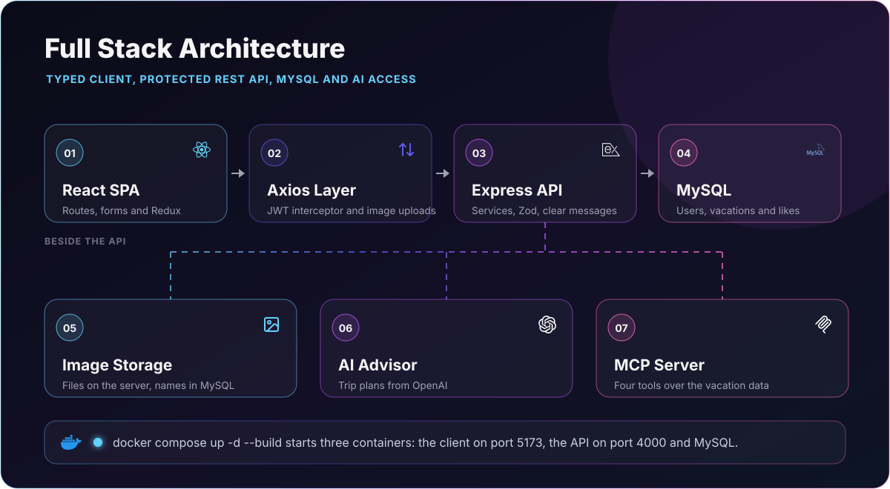

<p align="center">
  
</p>

<p align="center">
  <a href="#quick-start-for-reviewers"></a>
  <a href="#running-with-docker"></a>
  <a href="#running-locally"></a>
  <a href="https://github.com/itaygoldenberg/Wayfare"></a>
  <a href="https://www.linkedin.com/in/itay-goldenberg/"></a>
</p>

> [!TIP]
> **GitHub:** [github.com/itaygoldenberg/Wayfare](https://github.com/itaygoldenberg/Wayfare). The whole system runs with one command, `docker compose up -d --build`, as described [below](#running-with-docker). Open `http://localhost:5173` and sign in as the administrator `admin@wayfare.com` / `Atlas-Harbor-7319` or as the user `daniel@wayfare.com` / `1234` ([all demo accounts](#demo-accounts)).

<p align="center">
  <a href="#overview">Overview</a>&nbsp;&middot;&nbsp;
  <a href="#features">Features</a>&nbsp;&middot;&nbsp;
  <a href="#workflow">Workflow</a>&nbsp;&middot;&nbsp;
  <a href="#technology">Technology</a>&nbsp;&middot;&nbsp;
  <a href="#running-with-docker">Docker</a>&nbsp;&middot;&nbsp;
  <a href="#running-locally">Local setup</a>
</p>

> [!NOTE]
> A full-stack project demonstrating a typed React client, a protected REST API over MySQL, role-based screens, image uploads, reports, and AI-assisted access to the data through an MCP server.

## Overview

Wayfare is a vacation site. Travellers browse handpicked vacations and like the ones they love; an administrator manages the catalogue and sees what people like. It is made of a React SPA, an Express REST API and a MySQL database, all running in Docker.

The repository demonstrates typed models on both sides, Redux state, JWT roles, validation in the browser and again on the server, multipart image uploads, a likes report with a CSV export, AI trip recommendations, and an MCP server that lets a language model query the vacations directly.

<table><tr><td align="center" width="25%"><strong>REACT</strong><br /><sub>typed SPA</sub></td><td align="center" width="25%"><strong>EXPRESS</strong><br /><sub>REST API</sub></td><td align="center" width="25%"><strong>MYSQL</strong><br /><sub>users, vacations, likes</sub></td><td align="center" width="25%"><strong>AI + MCP</strong><br /><sub>assisted answers</sub></td></tr></table>

| Project detail | Implementation |
|---|---|
| Frontend | React 19, TypeScript, Vite, Redux Toolkit and React Router |
| Backend | Express 5 REST API written in TypeScript |
| Data | MySQL 8: users, vacations and likes |
| Images | Uploaded to a folder on the server; MySQL keeps only the file name |
| Reports | Recharts bar chart of likes per destination, and a CSV download |
| AI | OpenAI trip recommendations, plus an MCP server exposing four data tools |
| Security | JWT roles, hashed passwords, Zod validation, image-only uploads |
| Containers | Three-service Docker Compose stack |

## Contents

- [Overview](#overview)
- [Features](#features)
- [Workflow](#workflow)
- [Technology](#technology)
- [Project structure](#project-structure)
- [Quick start for reviewers](#quick-start-for-reviewers)
- [Running with Docker](#running-with-docker)
- [Running locally](#running-locally)
- [Demo accounts](#demo-accounts)
- [Validation](#validation)
- [Postman](#postman)
- [API routes](#api-routes)
- [Operational notes](#operational-notes)
- [Author](#author)

## Features

### Vacations for travellers

Signed-in users see the vacations as cards, nine per page with pagination, sorted by start date. Each card shows the destination with its country flag, the dates, the price, the description, the number of likes and whether the user liked it.

### Likes and filters

A user can like a vacation or take the like back. Four filters narrow the list: all vacations, my likes, happening now and coming up.

### Administrator workspace

The administrator adds, edits and deletes vacations. Deleting asks for confirmation first. The forms refuse a negative price or one above 10,000, an end date before the start date, and, when adding, a start date in the past. When editing, past dates are allowed and the image is optional. The destination and the description are written in English, like the AI pages: a Hebrew letter cannot be typed into them. Only real image files are accepted, and replacing or deleting a vacation also removes its old image file from the server.

### Clear messages

Every problem is reported in a plain sentence, such as "First name must have at least 2 characters." or "Price cannot be more than 10,000.", and never as a technical error. If the server cannot be reached, the site says "The server is not responding. Please try again in a moment." The full list is under [Validation](#validation).

### Reports and CSV

The report page shows a bar chart of likes per destination, with the destinations on the X axis and the likes on the Y axis, three headline figures and the average. The same data downloads as `wayfare-likes.csv`, which Excel opens as a table.

### AI travel advisor

A user types a destination in English and receives a short trip plan from OpenAI: why to go, the best time, top experiences, local food and a practical tip.

### Ask Wayfare (MCP)

A user asks a question about the vacations in plain English. The backend runs its own MCP server with four tools (all vacations, active vacations, future vacations and statistics). The model chooses the tools, the server runs them against MySQL, and the answer comes back with prices, dates and countries highlighted.

Both AI pages work in English only: a Hebrew letter cannot be typed into them, and the server refuses Hebrew text with 422.

### Authentication and authorization

Visitors can only register or sign in; every other page sends them to the login page. Registration checks that the email is free. The JWT carries the role, so users get likes and the AI pages, and the administrator gets the management pages and the report.

## Workflow

<p align="center">
  
</p>

## Technology

<p align="center">
  
</p>

| Technology | Role |
|---|---|
| React 19 + TypeScript | Typed single page application |
| Redux Toolkit | User and vacations state |
| React Router | Role-aware routes and the 404 page |
| React Hook Form | Validated forms and the image input |
| Recharts | The likes report chart |
| Vite | Development server and build |
| Node.js + Express 5 | REST API runtime |
| MySQL + mysql2 | Relational persistence with prepared statements |
| JWT + Zod | Authentication, roles and validation |
| smart-saver | Saving vacation images on the server |
| OpenAI | Trip recommendations and the assistant's answers |
| MCP SDK | Tool server that exposes the vacations to the model |
| Docker Compose | Three-service local stack |

## Project structure

```text
Itay Goldenberg/
|-- Frontend/                 React and TypeScript SPA
|   |-- src/components/       Layout, pages and feature areas
|   |-- src/services/         API service layer
|   |-- src/redux/            Global state
|   |-- src/models/           Typed frontend contracts
|   `-- Dockerfile            Client image
|-- Backend/                  Express and TypeScript API
|   |-- src/controllers/      HTTP routes
|   |-- src/services/         Business and database logic
|   |-- src/ai/               MCP server, its tools and its client
|   |-- src/middleware/       Roles and error handling
|   |-- src/models/           Backend contracts and validation
|   |-- src/assets/images/    Vacation images
|   |-- Postman/              Postman collection for the API
|   |-- .env.example          The API settings without their secret values
|   |-- Dockerfile            API image
|   `-- .dockerignore         Keeps .env and node_modules out of the image
|-- Database/
|   `-- wayfare.sql           Schema and seed data
|-- .github/readme/           README-only visual assets
|-- compose.yaml              Three-service Docker stack
`-- README.md                 Project documentation
```

## Quick start for reviewers

1. Make sure `Backend/.env` exists (the submitted zip includes it; a fresh clone creates it from `Backend/.env.example`, see [the note below](#backendenv)), then run `docker compose up -d --build` in the project folder.
2. Open `http://localhost:5173`.
3. Sign in as the administrator, `admin@wayfare.com` / `Atlas-Harbor-7319`, to add, edit and delete vacations, see the report and download the CSV. Sign in as a user, `daniel@wayfare.com` / `1234`, to like vacations, filter them and use the two AI pages. A new user can also register.

## Running with Docker

The stack builds and starts three containers: MySQL, the API and the client.

### Backend/.env

The API reads its settings and secrets from `Backend/.env`. Compose mounts it read-only into the API container, and it is never copied into an image. It is not in GitHub (`.gitignore` keeps it out). `Backend/.env.example` is there instead: the same variable names, with the secrets left empty. A fresh clone copies it to `Backend/.env` and fills it in, as described in [Running locally](#2-backend). With Docker, compose sets the database and port values itself, so only `JWT_SECRET`, `HASH_SALT` and `OPENAI_API_KEY` need values. The demo passwords only work with the original `HASH_SALT`, the salt they were hashed with, and the AI pages need a valid `OPENAI_API_KEY`.

From the project folder:

```bash
docker compose up -d --build
```

The client is served on `http://localhost:5173` and the API on `http://localhost:4000`.

MySQL and the API declare health checks: the API starts only after MySQL reports healthy, and the client only after the API does. MySQL creates and seeds the database from `Database/wayfare.sql` on the first start. The vacation dates in the seed are relative to the day it runs, so there are always vacations that ended, that are running now, and that have not started yet.

To stop the stack and keep the data:

```bash
docker compose down
```

To also delete the data, so the next start seeds a fresh database:

```bash
docker compose down -v
```

## Running locally

### 1. Database

Run `Database/wayfare.sql` in MySQL. It creates the `wayfare` database with its tables and seed data.

### 2. Backend

Create `Backend/.env` from the example file:

```bash
cp Backend/.env.example Backend/.env
```

Then fill in the empty values:

| Variable | Where it comes from |
|---|---|
| `MYSQL_USER`, `MYSQL_PASSWORD` | Your own MySQL user, the one MySQL Workbench connects with |
| `JWT_SECRET` | A long random text that signs the login tokens. Generate it with the command below |
| `HASH_SALT` | A long random text that is mixed into every password before it is hashed. Generate it the same way, and read the note below |
| `OPENAI_API_KEY` | A key from [platform.openai.com/api-keys](https://platform.openai.com/api-keys). Only the two AI pages need it |

Generate a random value, once for `JWT_SECRET` and once more for `HASH_SALT`:

```bash
node -e "console.log(require('crypto').randomBytes(32).toString('hex'))"
```

**A new `HASH_SALT` and the demo accounts.** The passwords in `Database/wayfare.sql` were hashed with the original salt, so with a new salt the demo accounts cannot sign in. Register a new user on the site, make it an administrator in MySQL, then sign out and sign in again, because the role is read into the token at sign-in:

```sql
UPDATE users SET role = 'Admin' WHERE email = 'your@email.com';
```

With Docker, the same line runs inside the MySQL container: `docker exec -it wayfare-mysql mysql -u root -p wayfare` (the root password is in `compose.yaml`).

Install and start the API:

```bash
cd Backend
npm install
npm start
```

### 3. Frontend

In a second terminal:

```bash
cd Frontend
npm install
npm start
```

The site opens on `http://localhost:5173` and talks to the API on `http://localhost:4000`.

## Demo accounts

| Role | Email | Password | What it can do |
|---|---|---|---|
| Administrator | `admin@wayfare.com` | `Atlas-Harbor-7319` | Add, edit and delete vacations, the likes report, the CSV download |
| User | `daniel@wayfare.com`, `noa@wayfare.com`, `maya@wayfare.com`, `omer@wayfare.com`, `yael@wayfare.com`, `amit@wayfare.com` | `1234` | Like and unlike, the four filters, the AI advisor and Ask Wayfare |

The administrator has its own, stronger password, so a regular user cannot guess their way into the management pages.

The seed holds 12 vacations and 24 likes. Its dates are relative to the day the database is created, so the "Happening now" and "Coming up" filters always have vacations in them.

## Validation

Every rule is checked twice: by the browser, for an immediate answer, and again by the server, which cannot be bypassed. The server's messages are the ones the user sees in the red pop-up.

| Form | Field | Rule | Message from the server |
|---|---|---|---|
| Register | First name, last name | Required, 2 to 50 characters (spaces alone do not count); spaces around the name are removed | `First name must have at least 2 characters.` |
| Register, login | Email | Required, a valid address, up to 100 characters | `Please enter a valid email address.` |
| Register | Email | Not already in use (in any letter case) | `Email already taken.` (409) |
| Register, login | Password | Required, 4 to 100 characters | `Password must have at least 4 characters.` |
| Login | Email and password | Must match an account | `Incorrect email or password.` (401) |
| Add, edit vacation | Destination | Required, 2 to 50 characters; spaces around it are removed | `Destination must have at least 2 characters.` |
| Add, edit vacation | Description | Required, 2 to 2,000 characters; spaces around it are removed | `Description must have at least 2 characters.` |
| Add, edit vacation | Destination, description | English only: a Hebrew letter cannot be typed | `Please write in English only.` |
| Add, edit vacation | Start and end date | Required, real calendar dates | `Start date must be a valid date.` |
| Add, edit vacation | End date | Not before the start date | `End date cannot be before the start date.` |
| Add vacation | Start date | Not in the past (editing allows past dates) | `Start date cannot be in the past.` |
| Add, edit vacation | Price | Required, a number from 0 to 10,000 (cents allowed) | `Price cannot be more than 10,000.` |
| Add vacation | Image | Required (optional when editing) | `Image is required.` |
| Add, edit vacation | Image | A .jpg, .jpeg, .png, .webp, .gif or .avif image | `The file must be an image.` |
| AI advisor | Destination | Required, 2 to 50 characters, English only | `Please write in English only.` |
| Ask Wayfare | Question | Required, 2 to 300 characters, English only | `Question must have at least 2 characters.` |

Validation errors answer 422. A broken JSON body answers 400, and a JSON body over 100 KB answers 413.

## Postman

The collection is in `Backend/Postman`: 28 requests in four folders, **Auth**, **User**, **Admin** and **Without a token**. JSON bodies are sent as raw JSON; adding or editing a vacation uses form-data, because it can carry an image file.

The whole collection uses one `{{token}}` (Authorization → Bearer Token). **Login as user** and **Login as admin** save the token they get back, so send **Login as user** before the User folder and **Login as admin** before the Admin folder. Run collection does this by itself, top to bottom. **Add a vacation** saves the new vacation's id in `{{vacationId}}`, and **Edit a vacation** and **Delete a vacation** use it.

In **Add a vacation**, choose any image under Body → form-data → `image` before sending: Postman stores only a file's path, and that path is different on every computer.

To run the whole collection from a terminal, with the API running:

```bash
npx newman run Backend/Postman/Wayfare.postman_collection.json --working-dir Backend/Postman
```

## API routes

| Method | Route | Access |
|---|---|---|
| POST | `/api/register` | Public |
| POST | `/api/login` | Public |
| GET | `/api/vacations` | Signed-in user or administrator |
| GET | `/api/vacations/:vacationId` | Signed-in user or administrator |
| POST | `/api/vacations` | Administrator |
| PUT | `/api/vacations/:vacationId` | Administrator |
| DELETE | `/api/vacations/:vacationId` | Administrator |
| GET | `/api/vacations/images/:imageName` | Public |
| POST | `/api/vacations/:vacationId/like` | User (not the administrator) |
| DELETE | `/api/vacations/:vacationId/like` | User (not the administrator) |
| POST | `/api/ai/recommendation` | Signed-in user or administrator |
| POST | `/api/ai/ask` | Signed-in user or administrator |

## Operational notes

- Never commit `Backend/.env` or real database credentials. Only `Backend/.env.example`, with the secrets left empty, goes to GitHub.
- Use long, unique JWT and hash secrets outside development. Changing the salt invalidates every stored password.
- The seeded accounts only sign in while `HASH_SALT` matches the salt the seed was hashed with.
- Run either the Docker stack or the local API, not both: they share port 4000, and a local API on that port takes the requests meant for the container.
- The MCP server runs inside the API process, so the OpenAI key stays on the server and no tunnel is needed.
- Uploaded files are accepted only when they are labelled as images and have an image extension (.jpg, .jpeg, .png, .webp, .gif or .avif). Their files are removed when a vacation's image is replaced or the vacation is deleted.
- The role is read from the signed JWT, never from the address, the request body or the user's name, so typing an administrator page into the address bar sends a regular user back to the vacations.

## Author

<p align="center">
  <strong>Itay Goldenberg</strong><br />
  Full Stack Developer
</p>

<p align="center">
  <a href="https://github.com/itaygoldenberg"></a>
  <a href="https://www.linkedin.com/in/itay-goldenberg/"></a>
</p>
